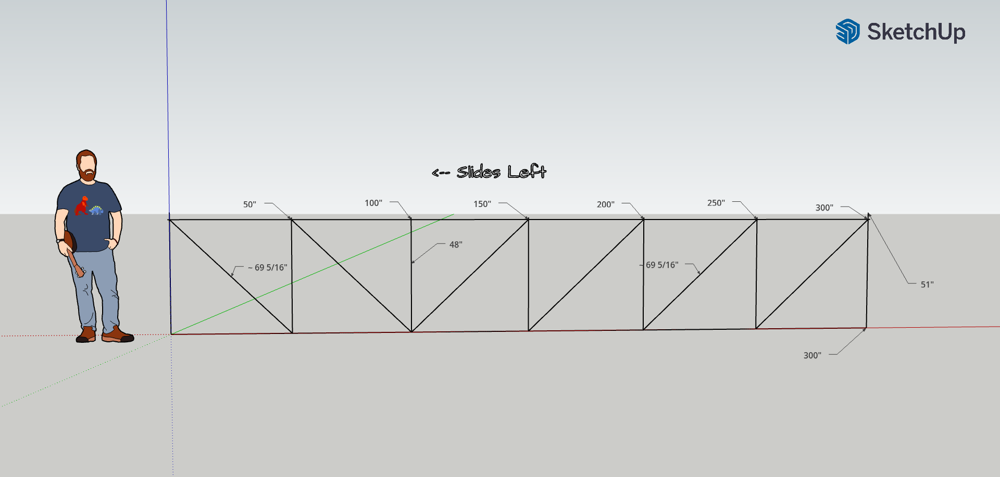
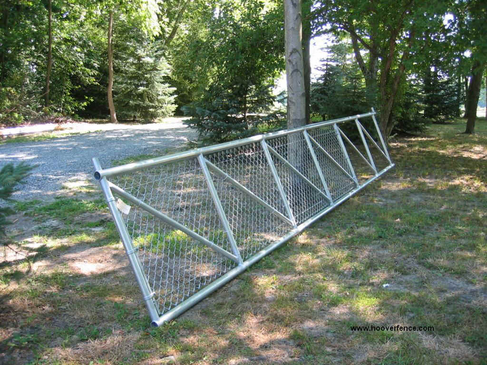

# Overview - Driveway Gate

After many years of not having a proper driveway gate, it is time to address the lack of gate and install one. This documents outlines the overall design of the gate to be installed.

## Gate Details

The gate will be a **sliding cantilever gate** that **opens to the left** (from street-view looking at the property/gate).

The gate will be installed using **two 4" posts with nylon rollers** to mount and support the gate.

The driveway opening is approximately **15.5 feet / 187 inches**.

The total length of the gate will be **25 feet** with a height of **4 feet**

### Frame

The gate frame will be constructed using a variety of round tubing sizes. All measurments in drawing below are in inches.

#### Dimensions Breakdown

- **Horizontal Rails**
  - Length: `300"`
  - Tubing: `2-1/2" O.D.`
- **Verticals**
  - Length:
        - Outer: `51"`
        - Inner: `48"`
  - Tubing:  `2" O.D.`
  - Spacing: `50"- On Center`
  - Notes: The ends should have an extra `3"` at the top that will serve as stops against the rollers.
- **Diagonal Braces**
  - Length: `69 5/16"`
  - Tubing: `1-5/8" O.D.`

Below is an example gate. It is made 4 feet high for a 15 foot opening.

## Helpful Links

- [Hoover Fencing - Cantilever Slide Gate System Overview](https://www.hooverfence.com/cantilever-slide-gates-overview)
  - I heavily used this website as a resource.
- [Sketchup - 3D Model](https://app.sketchup.com/share/tc/northAmerica/EK_B3erGchg?source=web&stoken=ym2tQd84zI8dOJN2XKOpnd71OFiQkTMLfINGGbNm0uaTveGFXqVZ-S_gGN6aI-xo)
