# Gate Wiring Diagram

## Gate Opener Control Board Terminals

1. `L` AC Live wire
2. `N` AC Neutral wire
3. `U` Motor common
4. `V` Motor forward
5. `W` Motor reverse
6. `LAMP`
7. `LAMP`
8. `DN` Normally closed limit switch (yellow)
9. `COM` Normally closed limit switch (black)
10. `UP` Normally closed limit switch (red)
11. `VCC` Auxilary output 12VDC (rated output less than 100mA). Use in conjuction with `13 - COM`
12. `PHO` Photocell sensor. Use in conjuction with `13 - COM`
13. `COM` Auxilary output 12vdc common/ground (rated output less than 100mA)
14. `O/S/C` Normally open dry contact signal input. Use in conjuction with `13 - COM`
15. `COM` Accept singal input of the gaet opening, usually connected to the normally open output of a vehicle sensor
16. `OPSW`Accept singal input of the gaet opening, usually connected to the normally open output of a vehicle sensor. Use in conjuction with `15- COM`

## Wiring Diagram

```mermaid
flowchart LR

subgraph GateControlBoard [Control Board Terminals]

    terminal1["1-L"]
    terminal2["2-N"]
    terminal3["3-U"]
    terminal4["4-V"]
    terminal5["5-W"]
    terminal6["6-LAMP"]
    terminal7["7-LAMP"]
    terminal8["8-DN"]
    terminal9["9-COM"]
    terminal10["10-UP"]
    terminal11["11-VCC"]
    terminal12["12-PHO"]
    terminal13["13-COM"]
    terminal14["14-O/S/C"]
    terminal15["15-COM"]
    terminal16["16-OPSW"]
end

subgraph VehicleSensor [Vehicle Sensor Exit Wand]

    vehRed["Red (11)"]---terminal11
    vehGreen["Green (13)"]---terminal13
    vehBlack["Black (15)"]---terminal15
    vehBlue["Blue (16)"]---terminal16

end

subgraph WireKeypad [Wired Keypad]
    keypadRed["Red (11)"]---terminal11
    keypadPurple["Purple (13)"]---terminal13
    keypadBlack["Black (13)"]---terminal13
    keypadBlue["Blue (14)"]---terminal14
end


subgraph HomeLink [Homelink Remote Control]
    homelinkTerminal1["Terminal 1 (13)"]---terminal13
    homelinkTerminal2["Terminal 2 (14)"]---terminal14
    homelinkTerminal7["Terminal 7 (11)"]---terminal11
    homelinkTerminal8["Terminal 8 (13)"]---terminal13
end

subgraph WarningLight [Warning Light]
    light1["Wire 1 (6)"]---terminal6
    light2["Wire 2 (7)"]---terminal7
end

subgraph InfraredSensor
    subgraph emitter [Emitter]
        emitterPositive["~+ (11)"]---terminal11
        emitterNegative["~- (13)"]---terminal13
    end

    subgraph receiver [Receiver]
        receiverPositive["~+ (11)"]---terminal11
        receiverNegative["~- (13)"]---terminal13
        receiverNC["NC (12)"]---terminal12
        receiverCOM["COM (13)"]---terminal13
    end
end


subgraph WallButton [Wall Push Button]
    wbWire1["Wire 1 (13)"]---terminal13
    wbWire2["Wire 2 (14)"]---terminal14
end
```

