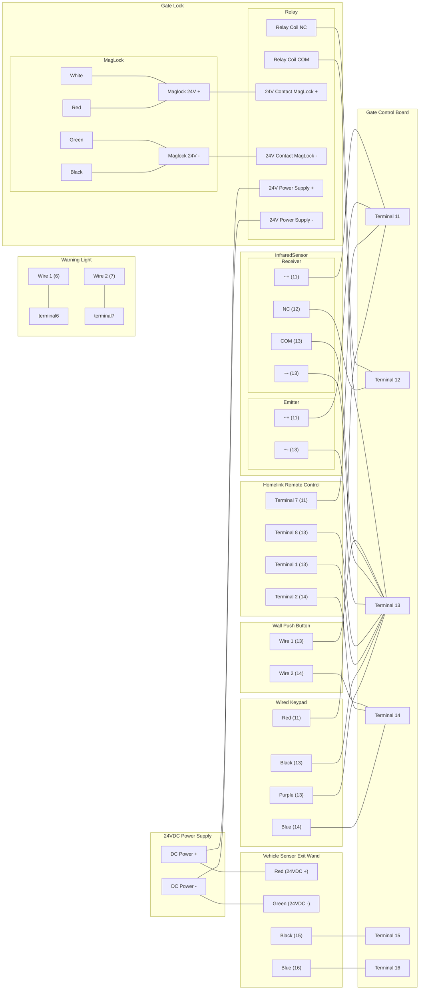

# Gate Wiring Diagram

## Gate Opener Control Board Terminals

1. `L` AC Live wire
2. `N` AC Neutral wire
3. `U` Motor common
4. `V` Motor forward
5. `W` Motor reverse
6. `LAMP`
7. `LAMP`
8. `DN` Normally closed limit switch (yellow)
9. `COM` Normally closed limit switch (black)
10. `UP` Normally closed limit switch (red)
11. `VCC` Auxilary output 12VDC (rated output less than 100mA). Use in conjuction with `13 - COM`
12. `PHO` Photocell sensor. Use in conjuction with `13 - COM`
13. `COM` Auxilary output 12vdc common/ground (rated output less than 100mA)
14. `O/S/C` Normally open dry contact signal input. Use in conjuction with `13 - COM`
15. `COM` Accept signal input of the gate opening, usually connected to the normally open output of a vehicle sensor
16. `OPSW`Accept signal input of the gate opening, usually connected to the normally open output of a vehicle sensor. Use in conjuction with `15- COM`

## Accessories Calculations

- **Wired Keypad:** 12-24VDC, < `100mA`
- **Vehicle Sensor** 12-24VDC, `40mA`
- **Homelink** 12-24VDC, `70mA`
- **Inrared Sensors** 12-24VDC, RX `15mA` TX `30mA`

## Connections to Control Board

- **Terminal 1** ``
- **Terminal 2** ``
- **Terminal 3** ``
- **Terminal 4** ``
- **Terminal 5** ``
- **Terminal 6**
  - Warning Light `Wire 1`
- **Terminal 7**
  - Warning Light `Wire 2`
- **Terminal 8**
- **Terminal 9**
- **Terminal 10**
- **Terminal 11**
  - Wired Keypad `Red`
  - Homelink `Terminal 7`
  - Infrared Sensor Receiver `+`
  - Infrared Sensor Transmitter `+`
- **Terminal 12**
  - Infrared Sensor Receiver `NC`
  - MagLock Relay `NC`
- **Terminal 13**
  - Wired Keypad `Purple`
  - Wired Keypad `Black`
  - Homelink `Terminal 1`
  - Homelink `Terminal 8`
  - Infrared Sensor Emitter `~ -`
  - Infrared Sensor Receiver `~ -`
  - Infrared Sensor Receiver `COM`
  - Wall Button `Wire 1`
  - MagLock Relay `COM`
- **Terminal 14**
  - Wired Keypad `Blue`
  - Homelink `Terminal 2`
  - Wall Button `Wire 2`
- **Terminal 15**
  - Vehicle Sensor `Black`
- **Terminal 16**
  - Vehicle Sensor `Blue`

## Wiring Diagram

